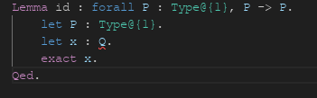

# Endive

[](https://github.com/ApollineRodary/Endive/actions/workflows/build-and-test.yml)

Endive is a WIP proof assistant for the Integrated Project (IP) computer science
course at ENS de Lyon.

## Architecture

Endive is made of many parts.

### Kernel

The core code of endive can be found in the `crates/endive-kernel` directory.
It contains a Rust library to type check, β-normalize and check the
β-convertibility of lambda terms. This library is meant to stay small and
independent.

It is based on a variant of intuitionistic type theory with inductive types.
β-normalization is implemented by evaluating terms into a weak head normal
form (Normalization by Evaluation, or NbE).

### [Playground](https://playground.endiveonline.fr)

The Endive playground lives in the `endive-playground` directory and provides a
way to write proofs using a Blockly based interface. It calls into the kernel
using the `crates/endive-wasm` crate which exports a WebAssembly interface to
the kernel.

### [Documentation](https://endiveonline.fr)

The main website contains documentation for the Endive playground. Its code can
be found in the `packages/website` directory.

### [The first editor](https://editor.endiveonline.fr)

In the directory `packages/editor` was a former version of Endive using code to
reprensent proofs. CodeMirror was used to implement the editor itself, and the
actual parsing and validation was done using an LSP server (see below).
Electron was used to make it into a standalone software (see the
`packages/app` directory).

Example of Endive code:

```coq
Lemma hypothetical_syllogism :
    forall P : Type@{1},
    forall Q : Type@{1},
    forall R : Type@{1},
      (P -> Q) -> (Q -> R) -> P -> R.
  let P : Type@{1}.
  let Q : Type@{1}.
  let R : Type@{1}.
  let pq : P -> Q.
  let qr : Q -> R.
  let p : P.
  exact qr (pq p).
Qed.
```

The editor and the Electron application were to be be sufficiently independent
so that the editor can be used as is in any web browser (either hiding the
menus about saving and loading files, or providing replacements for them).

When you open the editor, you can type text, load and save files. The menu can
be accessed pressinc Esc, and options can be selected typing the underlined
letter.

More details about the implementation are to be found inside the folders.

We stopped maintaining this version in favor of the playground. It is [still
available for testing](https://editor.endiveonline.fr) though.

### LSP server

The `endive-lsp-server` directory contains an implementation of a Language
Server Protocol server in OCaml for the first Endive editor. It is the
component responsible for actually doing the verification of proofs.

Currently implemented:

- Error diagnostics for syntax, grammar and logic errors.
- Autocompletion for variables and definitions.

### OCaml parsing and validation library

Internally, the LSP server uses the OCaml parsing and validation library. It is
in the `endive` directory. It uses Menhir and ocamllex to parse Endive code
into statements made of lambda terms and validates them by implementing the
usual type inference and β-reduction rules.

There is also an executable that uses this library to parse and validate a
proof file.

We stopped maintaining this code in favor of the new kernel used by the
playground, which supports induction.

### VS Code extension

A Visual Studio Code extension adding support for the LSP server and providing
syntax highlighting is available in the `packages/vscode-plugin` directory.



### The second editor

The second editor was a WIP project that tried to implement a WYSIWYG editor
for proofs in a LaTeX-like format. The code is available in the
`packages/editor2` directory. It was not hooked to the kernel in time so we
focused on the playground instead for the deadline.

## Building & running

### OCaml code

We recommend to use an [opam](https://opam.ocaml.org/) switch to isolate
dependencies from the global environment. It is similar to Python's virtual
environments, but for OCaml.

Create a switch for the project if you haven't already:

```sh
$ opam switch create . --deps-only --with-test --with-doc --locked
```

From now on, you need to enable it whenever you want to use OCaml tools:

```sh
$ eval $(opam env)
```

Build the LSP server and core parsing and validation library (add the `-w`
flag to automatically rebuild whenever a source file changes):

```sh
$ dune build
```

### Playground

Make sure that NPM packages are installed for the NPM workspace:

```sh
$ npm install
```

See [endive-playground/README.md](endive-playground/README.md).

### Documentation, first editor and second editor

Make sure that NPM packages are installed for the NPM workspace:

```sh
$ npm install
```

Then start a development server:

```sh
$ cd packages/website # or packages/editor,
                      # or packages/editor2
$ npm run serve
```

### VS Code extension

Build the VS Code extension (use `watch` instead of `compile` to rebuild
automatically when the source code changes):

```sh
$ cd packages/vscode-plugin
$ npm run compile
```

To use the VS Code extension, open `packages/vscode-plugin/src/extension.ts` in VS Code
and press <kbd>F5</kbd>.

The TextMate grammar file is located at `packages/vscode-plugin/endive.tmLanguage.json`.
The `editor.action.inspectTMScopes` command can be useful to debug the grammar.

## Contributing

To format the OCaml code:

```sh
$ dune fmt
```

To format the rest of the code:

```sh
$ npm run format
```

After modifying the VS Code extension (in `packages/vscode-plugin`):

```sh
$ npm run lint # Check for linter warnings.
```
