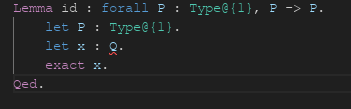

# Endive

[](https://github.com/ApollineRodary/Endive/actions/workflows/ci.yml)

Endive is a WIP proof assistant for the Integrated Project (IP) computer science
course at ENS de Lyon.

```coq
Lemma hypothetical_syllogism :
    forall P : Type@{1},
    forall Q : Type@{1},
    forall R : Type@{1},
      (P -> Q) -> (Q -> R) -> P -> R.
  let P : Type@{1}.
  let Q : Type@{1}.
  let R : Type@{1}.
  let pq : P -> Q.
  let qr : Q -> R.
  let p : P.
  exact qr (pq p).
Qed.
```

## Architecture

The core code of Endive can be found in the `endive` directory. It contains
OCaml code to parse and validate proofs and is meant to be reusable.

### The Interface

In the directory `endive-gui` is a mockup proposition of an interface using
CodeMirror for the editable area, HTML, CSS and Javascript for the rest of the
interface, and Electron to make it into a standalone software.

Ideally, the Interface and the Software should be sufficiently modular so that
the interface can be used as is in any web browser (either hiding the menus
about saving and loading files, or providing replacements for them).

To use the interface, go into the Software folder with a terminal, and type "npm
start". You can then type text, load and save files. (Menu can be accessed
pressinc Esc, and options can be selected typing the underlined letter.)

More details about the implementation are to be found inside the folders.

## LSP server

The `endive-lsp-server` directory contains an implementation of a Language
Server Protocol server for Endive.

Currently implemented:
- Error diagnostics for syntax, grammar and logic errors

### VS Code extension

A Visual Studio Code extension adding support for the LSP server and providing
syntax highlighting is available in the `endive-vscode` directory.



## Building & running

We recommend to use an [opam](https://opam.ocaml.org/) switch to isolate
dependencies from the global environment. It is similar to Python's virtual
environments, but for OCaml.

Create a switch for the project if you haven't already:
```sh
$ opam switch create .
```

From now on, you need to enable it whenever you want to use OCaml tools:
```sh
$ eval $(opam env)
```

Install the required dependencies:
```sh
$ opam install . --deps-only
```

Build the LSP server (add the `-w` flag to automatically rebuild whenever a
souce file changes):
```sh
$ dune build
```

Build the VS Code extension (use `watch` instead of `compile` to rebuild
automatically when the source code changes):
```sh
$ cd endive-vscode
$ npm run compile
```

To use the VS Code extension, open `endive-vscode/src/extension.ts` in VS Code
and press <kbd>F5</kbd>.

The TextMate grammar file is located at `endive-vscode/endive.tmLanguage.json`.
The `editor.action.inspectTMScopes` command can be useful to debug the grammar.

## Contributing

To format the OCaml code:
```sh
$ dune fmt
```

After modifying the VS Code extension (in `endive-vscode`):
```sh
$ npm run format # Format the code.
$ npm run lint   # Check for linter warnings.
```
